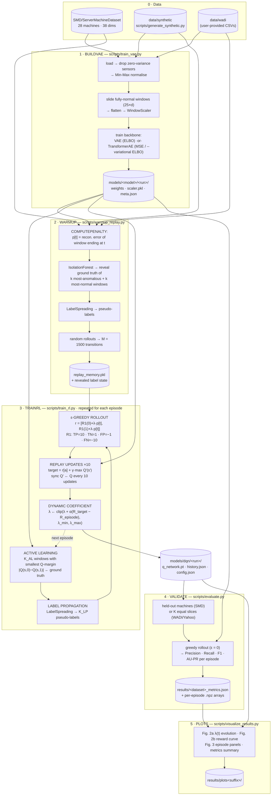
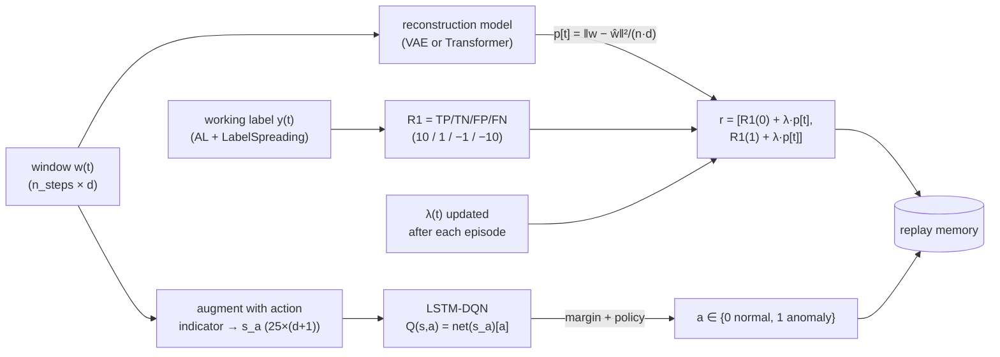
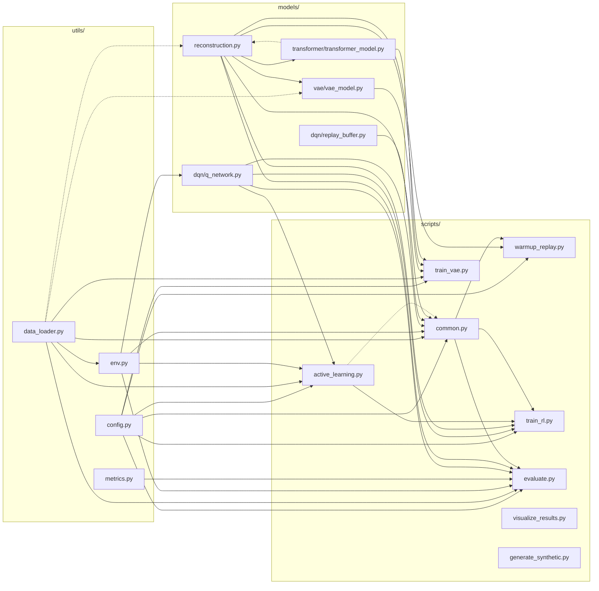

# DRSMT pipeline flow

End-to-end dataflow of the recreated pipeline (Algorithm 1 of the paper).
Every stage reads only the artifacts printed above it, so the stages must run
**sequentially in one terminal** (see README for the exact commands).

## Pipeline overview



## The reward that drives learning (per time step t)



## ASCII version

```
              ┌─────────────────────────── DATA ───────────────────────────┐
              │  SMD/ServerMachineDataset    data/synthetic    data/wadi   │
              └──────┬───────────────────────────┬────────────────┬────────┘
                     │                           │                │
     ┌───────────────▼────────────────────────┐  │                │
     │ 1) BUILDVAE   scripts/train_vae.py     │  │                │
     │    load → zero-var drop → MinMax norm  │  │                │
     │    normal windows (25×d) → flatten     │  │                │
     │    WindowScaler → VAE / TransformerAE  │  │                │
     └───────────────┬────────────────────────┘  │                │
                     │ models/<model>/<run>/     │                │
                     │ weights · scaler · meta   │                │
     ┌───────────────▼────────────────────────┐  │                │
     │ 2) WARMUP    scripts/warmup_replay.py  │◄─┴────────────────┘
     │    COMPUTEPENALTY → p[t] per series    │
     │    IsolationForest → reveal labels     │
     │    LabelSpreading → pseudo-labels      │
     │    random rollouts → M=1500 transitions│
     └───────────────┬────────────────────────┘
                     │ replay_memory.pkl (+ revealed label state)
     ┌───────────────▼─────────────────────────────────────────┐
     │ 3) TRAINRL   scripts/train_rl.py     (per episode)      │
     │   ┌─────────────────────────────────────────────────┐   │
     │   │ AL: K_AL smallest |Q(s,0)−Q(s,1)| ← ground truth│   │
     │   │ LP: LabelSpreading → K_LP pseudo-labels         │   │
     │   │ rollout: ε-greedy                               │   │
     │   │   r = [R1(0)+λ·p[t], R1(1)+λ·p[t]]              │   │
     │   │ replay Bellman updates ×10 (sync Q' every 10)   │   │
     │   │ λ ← clip(λ + α(R_target − R_episode))           │   │
     │   └────────────────────────┬────────────────────────┘   │
     └────────────────────────────┼────────────────────────────┘
                                  │ models/dqn/<run>/ q_network.pt · history.json
     ┌────────────────────────────▼────────────────┐
     │ 4) VALIDATE   scripts/evaluate.py           │
     │    held-out machines / K slices, ε = 0      │
     │    Precision · Recall · F1 · AU-PR / episode│
     └────────────────────────────┬────────────────┘
                                  │ results/<ds>_metrics.json + .npz
     ┌────────────────────────────▼────────────────┐
     │ 5) PLOTS      scripts/visualize_results.py  │
     │    Fig.2a λ(t) · Fig.2b reward · Fig.3 panels│
     └────────────────────────────┬────────────────┘
                                   └──► results/plots/
```

## Artifacts at a glance

| Stage | Consumes | Produces |
| --- | --- | --- |
| `generate_synthetic.py` | — | `data/synthetic/{train,test,test_label}/*.txt`, `manifest.json` |
| `train_vae.py` | dataset dir | `models/<model>/<run>/{vae.pt\|transformer_ae.pt, scaler.pkl, meta.json}` |
| `warmup_replay.py` | dataset dir + recon model | `replay_memory*.pkl` (transitions + label state + λ₀) |
| `train_rl.py` | dataset dir + recon model + replay | `models/dqn/<run>/{q_network.pt, meta.json, config.json, history.json}` |
| `evaluate.py` | dataset dir + recon model + DQN | `results/<dataset>_metrics.json`, `results/<dataset>_episodes/*.npz` |
| `visualize_results.py` | history.json + .npz + metrics.json | `results/plots*/fig2*.png, validation_*.png, metrics_*.png` |

---

## File reference — every file and how it connects

This section documents each file of the recreated implementation, its key
API, and exactly how it is wired to the other files.  Layering rule:
`scripts/` orchestrate, `models/` hold the neural networks, `utils/` holds
everything shared; `scripts/` may import from `models/` and `utils/`,
`models/` may import from `utils/`, `utils/` imports nothing internal
except `utils/env.py → utils/data_loader.py`.

### Package map

```
utils/
├── config.py          # every hyper-parameter of the paper/repo (DRSMTConfig) + set_seed
├── data_loader.py     # datasets, sliding windows, zero-variance feature selection, Min-Max scaling
├── env.py             # the MDP: windows, action indicator, reward vector, semi-supervised labels
├── metrics.py         # Precision / Recall / F1 / AU-PR (Table II) + aggregation
└── __init__.py        # convenience re-exports

models/
├── vae/vae_model.py           # paper's VAE backbone + WindowScaler + VAE-local persistence
├── transformer/transformer_model.py   # optional TransformerAE backbone (same contract)
├── reconstruction.py          # backbone-agnostic hub: train / penalty / save / load factory
├── dqn/q_network.py           # LSTM-64 Q-network + diagonal Q readout + target net + persistence
├── dqn/replay_buffer.py       # experience replay ⟨s, a, r, s', done⟩
└── __init__.py                # convenience re-exports

scripts/
├── common.py              # shared helpers: data prep, envs, schedules, rollout, WARMUP, replay I/O
├── train_vae.py           # stage 1 · BUILDVAE      (VAE or --model transformer)
├── warmup_replay.py       # stage 2 · WARMUP       (CLI over common.warmup_replay_memory)
├── train_rl.py            # stage 3 · TRAINRL      (episode loop: AL+LP → rollout → updates → λ)
├── active_learning.py     # margin sampling + LabelSpreading module (imported by train_rl/common)
├── evaluate.py            # stage 4 · VALIDATE     (greedy episodes → metrics JSON + npz)
├── visualize_results.py   # stage 5 · Fig. 2 + Fig. 3 plots
├── generate_synthetic.py  # synthetic SMD-style benchmark generator
└── (no __init__ needed — namespace package; each script bootstraps sys.path)

tests/
├── smoke_test_synthetic.sh   # stages 0-5 end-to-end on synthetic data  [EPISODES] [MODEL]
└── run_smd.sh                # stages 1-5 on the real SMD dataset       [EPISODES] [MODEL]
```

### Import graph (who imports whom)

Solid = top-level import; dotted = deferred (function-level) import.



### Connection matrix

| File | Imports from (internal) | Imported by | Reads (artifacts) | Writes (artifacts) |
| --- | --- | --- | --- | --- |
| `utils/config.py` | — | every script & `common` | — | `config.json` (via `train_rl`) |
| `utils/data_loader.py` | — | `env`, `reconstruction`*, `q_network`→`env`, all scripts | dataset dirs (`SMD/…`, `data/synthetic`, `data/wadi`, `normal-data/`) | — (in-memory `LoadedData`) |
| `utils/env.py` | `data_loader` | `q_network`, `common`, `active_learning`, `evaluate` | — | — (in-memory) |
| `utils/metrics.py` | — | `evaluate` | — | metrics inside `results/*.json` |
| `models/vae/vae_model.py` | `data_loader`* | `reconstruction` (factory), `train_vae` | — | (legacy) `models/vae/<run>/vae.pt` |
| `models/transformer/transformer_model.py` | `reconstruction`* | `reconstruction` (factory), `train_vae` | — | — |
| `models/reconstruction.py` | `vae_model`, `transformer_model`, `data_loader`* | `common`, `train_vae`, `warmup_replay`, `train_rl`, `evaluate`, `active_learning`, `models/__init__` | `meta.json` + weights + `scaler.pkl` (on load) | `models/<model>/<run>/{weights, scaler.pkl, meta.json}` |
| `models/dqn/q_network.py` | `env` (`state_pair`) | `common`, `active_learning`, `train_rl`, `evaluate` | `meta.json` + `q_network.pt` (on load) | `models/dqn/<run>/{q_network.pt, meta.json}` |
| `models/dqn/replay_buffer.py` | — | `common`, `train_rl` | replay pickle (on load) | replay pickle |
| `scripts/common.py` | `q_network`, `replay_buffer`, `reconstruction`, `config`, `data_loader`, `env`, `active_learning`* | `train_rl`, `warmup_replay`, `evaluate` | replay pickle (load payload) | replay payload pickle |
| `scripts/active_learning.py` | `q_network`, `config`, `data_loader`, `env` | `train_rl`, `common` (warm-up), CLI | recon model + DQN dirs (CLI only) | label state inside envs |
| `scripts/train_vae.py` | `reconstruction`, `transformer_model`, `vae_model`, `config`, `data_loader` | — (CLI) | dataset dirs | `models/<model>/<run>/{vae.pt\|transformer_ae.pt, scaler.pkl, meta.json}` |
| `scripts/warmup_replay.py` | `reconstruction`, `common`, `config` | — (CLI) | dataset dirs + recon model dir | `replay_memory*.pkl` |
| `scripts/train_rl.py` | `q_network`, `reconstruction`, `active_learning`, `common`, `config` | — (CLI) | dataset dirs + recon model + replay pickle | `models/dqn/<run>/{q_network.pt, meta.json, config.json, history.json}` |
| `scripts/evaluate.py` | `q_network`, `reconstruction`, `common`, `config`, `data_loader`, `env`, `metrics` | — (CLI) | dataset dirs + recon model + DQN dir | `results/<ds>_metrics.json`, `results/<ds>_episodes/*.npz` |
| `scripts/visualize_results.py` | — (numpy/matplotlib only) | — (CLI) | `history.json`, `*.npz`, metrics JSON | `results/plots*/**.png` |
| `scripts/generate_synthetic.py` | — (numpy only) | — (CLI) | — | `data/synthetic/{train,test,test_label}/*.txt`, `manifest.json` |

\* deferred / function-level import.

### Per-file documentation

#### utils/config.py — hyper-parameters & reproducibility

* **Role:** single source of truth for every constant in the paper (Sec. IV/V,
  Fig. 2) and the original code: window `n_steps`, VAE settings
  (`intermediate_dim=64`, `latent_dim=10`, epochs/lr/grad-clip, `vae_scaler`),
  the reconstruction-backbone selector (`recon_model: "vae"|"transformer"`
  plus the transformer hyper-parameters), DQN settings (LSTM `n_hidden_dim=64`,
  `episodes`, `batch_size=128`, `discount_factor`, replay sizes,
  `num_updates_per_episode=10`, `update_target_every=10`, ε-schedule), the
  asymmetric reward (`tp/tn/fp/fn = 10/1/−1/−10`, `reward_unlabeled`), the λ
  controller (`lambda_init/alpha/target/min/max`), active learning
  (`al_budget`, `al_fraction`, `lp_budget`, LabelSpreading graph settings),
  and warm-up settings.
* **Key API:** `DRSMTConfig` dataclass with `.resolved_device()`,
  `.with_overrides()` (used by `train_rl` to apply `al_fraction` per series),
  `.save()/.load()`; `set_seed(seed)` seeds python/numpy/torch.
* **Connected to:** imported by every script and by `scripts/common.py`;
  persisted as `config.json` next to the trained DQN for full run provenance.

#### utils/data_loader.py — data in, windows out

* **Role:** the only place that touches raw dataset files.  Implements the
  paper's preprocessing (Sec. IV-A): zero-variance feature removal,
  Min-Max normalisation (fit on the training split only), and sliding windows
  aligned so that window *i* ends at time index *i + n_steps − 1*.
* **Key API:**
  * Containers: `SeriesData(name, values (T,d), labels (T,))`, `LoadedData`.
  * Loaders: `load_dataset(kind, dir)` dispatches to `load_smd_style`
    (SMD **and** synthetic — deduplicates the `.txt`/`.csv` pairs shipped in
    `SMD/…/test/` and matches labels by stem), `load_wadi`
    (single CSV + attack-label CSV, cleaned exactly like the original script)
    and `load_yahoo` (`normal-data/real_*.csv`).
  * Preprocessing: `zero_variance_mask`, `drop_zero_variance_features`,
    `fit_minmax` / `apply_minmax` / `normalize_data`, and
    `prepare_data(kind, dir)` = load + feature selection.
  * Windows: `make_windows`, `window_labels` (label of a window's last step —
    the step the agent classifies), `flatten_windows`,
    `collect_normal_windows` (fully-normal windows only, per-series
    subsampling before materialisation → VAE training set).
* **Connected to:** `utils/env.py` builds its windows with `make_windows`;
  `models/reconstruction.py` uses `make_windows/flatten_windows` inside
  `compute_penalty_array`; every stage script normalises through
  `prepare_data` / `normalize_data` so the VAE/Transformer, the penalty
  arrays and the RL observations all see identical scaling.

#### utils/env.py — the Markov decision process (Sec. IV-B)

* **Role:** defines state, action, and reward exactly as the paper and the
  original code do.  An episode classifies time steps `t = n_steps … T−1`;
  the state is the window ending at `t`, augmented with a constant
  action-indicator channel (`augment_state` → `(n_steps, d+1)`,
  `state_pair` stacks both candidates).  Rewards follow the
  **semi-supervised working label column**: `work_labels` starts fully
  unlabelled (`UNLABELED = −1`), is filled by the warm-up and by the
  per-episode active learning, and `reward_vector(t)` returns
  `r = [R1(0) + λ·p[t], R1(1) + λ·p[t]]` with `p` the pre-computed
  reconstruction-penalty array and `R1` the TP/TN/FP/FN vector.
* **Key API:** `TimeSeriesEnv` with `reset`, `step(action)`
  (returns reward *vector* + next window), `reward_vector`, `reveal`
  (write a ground-truth or propagated label), `labeled_indices`,
  `set_dynamic_coef` (called every episode with the current λ),
  `get_states_list` (all windows — used for Q-table precomputation,
  margin sampling and the warm-up); helpers `classification_reward`,
  `augment_state`, `state_pair`, `env_from_series`.
* **Connected to:** `models/dqn/q_network.py` uses `state_pair` for the
  diagonal Q readout; `scripts/common.py` wraps series into envs
  (`build_envs`) and drives them (`rollout`); `scripts/evaluate.py`
  builds fresh envs per validation episode; `scripts/active_learning.py`
  writes labels into `work_labels`.

#### utils/metrics.py — Table II numbers

* **Role:** the exact evaluation of Sec. V: point-wise precision/recall/F1
  (`sklearn`, `average='binary'`, `zero_division=0`) and AU-PR as
  `average_precision_score` on the binary predictions (what Fig. 3's bottom
  panel plots), with an optional score-based AU-PR (`y_score`, e.g.
  `Q(s,1)−Q(s,0)`).  Degenerate episodes (single class) yield 0.0 like the
  original `try/except`.
* **Key API:** `binary_metrics`, `aggregate_metrics` (mean ± std across
  episodes — the `x ± y` of Table II), `format_metrics_table`,
  `point_adjust_metrics` (optional, off by default),
  `precision_recall_curve_points`.
* **Connected to:** used by `scripts/evaluate.py` only; results land in
  `results/<dataset>_metrics.json` and are printed as a table.

#### models/vae/vae_model.py — the paper's backbone (Sec. III-B / IV-A)

* **Role:** the Variational Autoencoder: flattened `(n_steps·d)` input →
  3×Dense(64)+ReLU encoder → μ, log σ² (10-d, clamped ±10) → reparameterised
  z → Dense(64)+ReLU → sigmoid Dense reconstruction.  Loss = per-sample sum
  of squared errors (≡ `mse · original_dim`) + KL, exactly the original
  implementation's ELBO.  Also owns the `WindowScaler` ("standard" per
  Algorithm 1 line 6, or "robust" per the WADI variant, with ±10 clipping).
* **Key API:** `WindowScaler.fit/transform`; `VAE.encode / reparameterize /
  decode / forward / elbo_loss / reconstruct / compute_loss`;
  `train_vae` (Adam, per-epoch shuffle, grad-clip); VAE-local
  `reconstruction_errors` and `compute_penalty_array`;
  `save_vae` / `load_vae` (legacy-compatible `vae.pt` layout).
* **Connected to:** built and trained by `scripts/train_vae.py` through the
  backbone-agnostic factory; the *only* way the rest of the pipeline touches
  it is via `models/reconstruction.py` (`compute_loss`, `reconstruct`).

#### models/transformer/transformer_model.py — optional backbone

* **Role:** drop-in replacement for the VAE with the same I/O contract:
  per-time-step tokens (Linear `d → d_model` + sinusoidal positional
  encoding) → TransformerEncoder → mean-pool → 10-d latent bottleneck
  (variational head optional → Transformer-VAE with the same ELBO; default
  deterministic AE) → decoder blocks → per-step sigmoid reconstruction.
* **Key API:** `PositionalEncoding`; `TransformerAE.encode / decode /
  forward / reconstruct / compute_loss`; `train_transformer` (thin delegate
  to `models.reconstruction.train_reconstructor`).
* **Connected to:** instantiated by `train_vae.py --model transformer`;
  rebuilt by `load_reconstructor` when `meta.json` says
  `"architecture": "transformer_ae"`.

#### models/reconstruction.py — the backbone-agnostic hub

* **Role:** the seam that makes the VAE/Transformer interchangeable and the
  reason WARMUP/TRAINRL/VALIDATE never change.  Anything reconstruction-
  shaped goes through here: training, per-window error, per-series penalty
  arrays (Algorithm 1 COMPUTEPENALTY: window ending at `t`, zero-padded
  first `n_steps−1`, chunked for WADI-scale series), persistence, and the
  load factory that dispatches on `meta.json`'s `architecture` field.
* **Key API:** `train_reconstructor(model, windows, …)` (uses the shared
  `model.compute_loss` contract); `reconstruction_errors` (uses
  `model.reconstruct`); `compute_penalty_array(model, scaler, values,
  n_steps, …)`; `save_reconstructor` / `load_reconstructor`.
* **Connected to:** imported by `scripts/common.py`, `train_vae`,
  `warmup_replay`, `train_rl`, `evaluate`, and `active_learning` (CLI);
  internally imports both backbones.

#### models/dqn/q_network.py — the agent (Sec. III-A / IV-B)

* **Role:** LSTM(64) over the `(n_steps, d+1)` augmented state → dense head
  with 2 outputs.  Action-value convention (identical to the original
  selection rule `a = 1 if q1[1] > q0[0] else 0`):
  `Q(s, a) = QNet(s_a)[a]` — the diagonal readout implemented batched in
  `q_values_pair`.  The Bellman bootstrap is
  `V(s') = max(QNet(s'_0)[0], QNet(s'_1)[1])` (`q_values_max_next`); the
  target network is a second frozen copy (`sync_target`, Algorithm 1 line 32).
* **Key API:** `QNetwork.forward`; `q_values_pair(model, windows, device)`;
  `q_values_max_next(target, next_windows, device)`; `sync_target`;
  `save_q_network` / `load_q_network` (`q_network.pt` + `meta.json` with
  `n_steps/n_features/n_hidden_dim` used for cross-checks at load time).
* **Connected to:** trained and queried by `scripts/train_rl.py`; loaded by
  `scripts/evaluate.py`; margins for active learning come from the same
  readout (`scripts/active_learning.py`).

#### models/dqn/replay_buffer.py — experience replay (Algorithm 1 line 31)

* **Role:** fixed-capacity FIFO of `Transition(window, action, reward (2,),
  next_window|None, done)`.  Windows are stored *without* the indicator
  channel (it is determined by the action, appended when batches are built)
  which keeps the memory compact for high-dimensional datasets.  Sampling is
  uniform without replacement, like `random.sample` in the original code.
* **Key API:** `push` / `extend` / `sample(batch_size, n_steps, n_features)`
  → `(windows, actions, rewards, next_windows, dones)`; `save` / `load`
  (plain pickle).
* **Connected to:** filled by `common.rollout` (and the warm-up), consumed
  by the Bellman updates in `scripts/train_rl.py`.

#### scripts/common.py — the connector between stages

* **Role:** everything that more than one stage needs.  If you delete any
  stage script, this file is what keeps the others consistent.
* **Key API:**
  * `load_and_prepare(cfg)` — load + zero-variance drop + Min-Max
    normalisation; *the* data entry point for stages 2-4 (identical
    statistics every time, no leakage).
  * `split_train_valid(series, ratio)` — first 80% of the machines train,
    tail validates (single-series datasets keep the whole series on both
    sides and are sliced at validation time).
  * `build_envs(...)` — COMPUTEPENALTY per series → penalty-backed
    `TimeSeriesEnv` per series.
  * `precompute_q_table(policy, env)` — batched `Q(s,0), Q(s,1)` for every
    window (the policy is frozen during a rollout, so rollouts need no
    per-step forward passes).
  * `epsilon_at(cfg, episode, updates)` — ε schedule ("episode" =
    WADI-style linear decay per episode, default; "linear" = SMD-style over
    gradient updates); `update_lambda(cfg, λ, R_episode)` — the Eq. 4
    proportional controller.
  * `rollout(env, policy, ε, rng, replay=None, record=False, q_table=None)`
    — one episode; pushes transitions and (in record mode) returns
    predictions/ground-truth/Q-scores/series values for evaluation.
  * `warmup_replay_memory(envs, cfg, rng)` — the full WARMUP block:
    IsolationForest on the last row of the windows → reveal k most-anomalous
    + k most-normal ground-truth labels → LabelSpreading pseudo-labels the
    most-confident unlabelled windows → random rollouts until
    `replay_memory_init_size`.
  * `save_replay_payload` / `load_replay_payload` — replay transitions
    **plus** the revealed label state plus λ₀, so warm-up (a separate
    process) transfers its semi-supervised state into `train_rl`.
* **Connected to:** `train_rl` (episodes, schedules, updates),
  `warmup_replay` (thin CLI), `evaluate` (data + greedy rollout).

#### scripts/active_learning.py — margin sampling + label propagation (Sec. IV-C)

* **Role:** implements the two query mechanisms.  `MarginActiveLearner`
  ranks windows by `|Q(s,0)−Q(s,1)|` and `select` returns the K smallest
  (most uncertain) excluding already-labelled ones.  `fit_label_spreading`
  fits `sklearn LabelSpreading(kernel='knn')` on (subsampled) flattened
  windows with `-1` unknowns.  `active_learning_step` composes the per-
  episode round of Algorithm 1 lines 19-21: reveal K_AL ground-truth labels,
  fit the LP graph with all revealed labels, pseudo-label the K_LP most
  uncertain remaining windows with `lp.transduction_`.
* **Key API:** `MarginActiveLearner.q_values / margins / select`;
  `fit_label_spreading`; `active_learning_step(env, learner, cfg)`;
  plus a standalone CLI (`python scripts/active_learning.py …`) that
  demonstrates one round with a trained agent.
* **Connected to:** called per episode by `scripts/train_rl.py`; its
  `fit_label_spreading` is reused by the warm-up in `scripts/common.py`.

#### scripts/train_vae.py — stage 1 · BUILDVAE (Algorithm 1 lines 1-6)

* **Role:** trains the reconstruction backbone on normal windows and writes
  the artifact every later stage reads.  Pipeline: load + zero-variance
  drop + Min-Max normalise (identical to the RL side) → fully-normal windows
  → `WindowScaler` → backbone (`--model vae` default | `--model transformer`
  ± `--variational`) → `train_reconstructor` → sanity report (reconstruction
  error on normal windows, and normal-vs-anomaly separability on the first
  test machine) → `save_reconstructor`.
* **Connected to:** consumes `utils/data_loader`, `models/reconstruction`;
  produces `models/<model>/<run>/{vae.pt|transformer_ae.pt, scaler.pkl,
  meta.json}` which `warmup_replay`, `train_rl`, `evaluate` and the
  `active_learning` CLI all load through `load_reconstructor`.

#### scripts/warmup_replay.py — stage 2 · WARMUP (Algorithm 1 lines 12-15)

* **Role:** thin CLI over `common.warmup_replay_memory`.  Fills the replay
  memory to M with random-policy transitions whose rewards use λ₀, and saves
  the transitions together with the revealed label state so training
  continues from exactly this semi-supervised point.
* **Connected to:** consumes the recon model dir + dataset; produces
  `replay_memory*.pkl` consumed by `train_rl.py` (which re-runs the same
  warm-up inline if the pickle is missing).

#### scripts/train_rl.py — stage 3 · TRAINRL (Algorithm 1 lines 16-34)

* **Role:** the main loop (see the per-episode subgraph in the pipeline
  diagram above): AL+LP → ε-greedy rollout with
  `r = [R1(0)+λ·p[t], R1(1)+λ·p[t]]` → `num_updates_per_episode` Bellman
  updates (`target_vec[a] = r[a] + γ·max Q'(s',·)`, only the taken action
  regressed; target sync every C updates) → λ controller → history/logging
  → periodic checkpoints.  Applies `--al_fraction` per series and adopts
  `n_steps` from the recon-model meta (fail-fast on feature mismatches).
* **Connected to:** consumes recon model + replay payload; produces
  `models/dqn/<run>/{q_network.pt, meta.json, config.json, history.json}`.

#### scripts/evaluate.py — stage 4 · VALIDATE (Algorithm 1 lines 36-43)

* **Role:** greedy (ε=0) episodes over the held-out machines (multi-series
  datasets) or over K equal slices of the single series (`_slice_series`);
  per-episode `binary_metrics` (with Q-margin as the continuous score);
  mean ± std aggregation; metrics JSON + per-episode `.npz` arrays for the
  Fig. 3 panels.  Cross-checks DQN meta vs recon-model meta before running.
* **Connected to:** consumes both model dirs + dataset; produces
  `results/<ds>_metrics.json` and `results/<ds>_episodes/*.npz`.

#### scripts/visualize_results.py — stage 5 · figures

* **Role:** paper figures from artifacts only: Fig. 2a (`λ(t)` per episode)
  and Fig. 2b (reward curve) from `history.json`; Fig. 3-style four-panel
  plots (series, predictions, ground truth, AU-PR line) per `.npz`; a
  metrics summary bar chart from the JSON.
* **Connected to:** reads only files written by `train_rl` and `evaluate`;
  writes `results/plots*/`.

#### scripts/generate_synthetic.py — benchmark generator

* **Role:** deterministic SMD-style synthetic benchmark (correlated sensors,
  setpoint square-waves, AR(1) channels; spikes / level shifts /
  correlation breaks / drifts / stuck-at faults at a target anomaly rate).
  Exists so the whole pipeline can be exercised without the
  access-restricted WADI download (SMD ships in the repo).
* **Connected to:** writes the exact directory layout that
  `load_smd_style` consumes, so `--dataset synthetic` needs no special
  code anywhere else.

#### tests/ — runnable pipelines

* `smoke_test_synthetic.sh [EPISODES] [MODEL]` — generate → BUILDVAE →
  WARMUP → TRAINRL → VALIDATE → plots on `data/synthetic`
  (`set -euo pipefail`, so it stops at the first failure).
* `run_smd.sh [EPISODES] [MODEL]` — the same five stages on the real
  SMD data with the paper's hyper-parameters.
* Both scripts are the executable form of the pipeline diagram at the top
  of this file and double as reference for the exact CLI arguments.
